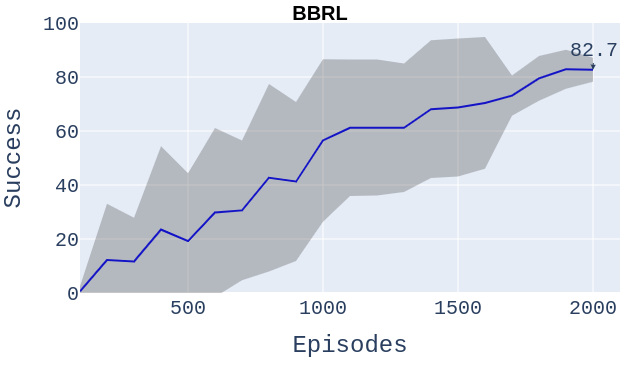

# Source Code for Intrinsic Robotic Introspection: Learning Internal States From Neuron Activations

> To run this code you first need to have a MuJoCo licence and mjpro150.

# Setting Up
Provided you have a valid MuJoCo licence, run `pip install -r requirements.txt` to install the necessary dependencies for the code.

# Description
This work builds on BBRL by extracting internal states from its feature extraction network and using them to train the actor critic network.  The architecture is shown below.

The approach we take in building internal states is shown below.

# Training BBRL
The `bbrl` directory contains the code for the models and training the behaviours.  You will need to update the `weights_path` argument for saving model weights to a path of your choice.

## Training Behaviours
To train the approach behaviour execute the following command: `python bbrl/main.py approach`.  Wait until the model converges to a high success value then stop.

Repeat for all other behaviours to replacing approach with grasp, retract and choreograph stopping when the behaviour converges.

# Collecting Activations
To collect activations run the `test.py` file with the pre-trained BBRL model. The final line in this file save the tensors in a `.pt` file. Change the path to a path of your choice.

# Training VAE
To train the VAE on reconstructing the activations and learn the internal states execute `python vae_train.py train` passing the required arguments in the command line.

You can also visualise the latent space of the VAE.

# Using Internal States
To use internal states you need the pre-trained feature and reactive network weights.  You need to initialise the Choreographer network with the argument `internal_states=True`.  Change the dimensionality of the LSTM input dimension to the correct one as specified in the file `bbrl/models/actor_critic.py`.  Uncomment the correct lines in the file `bbrl/models/__init__.py` in the Choreographer class to use the correct internal states and also change the VAE weights path in the same class to the path where you saved the VAE weights.

Execute `python bbrl/main.py choreograph` to train BBRL with internal states.

# Results

## Success

---

## State Values

## Training for 5000 episodes
We also trained all low-level behaviours and the choreographer for more than the recommended number of episodes to ensure behaviours reach 100% success.  We did this over 10 runs for BBRL and each proposed variant.

---

---

---

---

